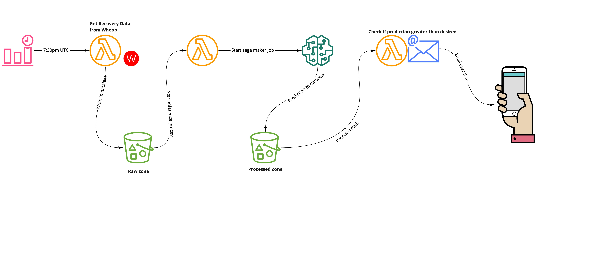

# Becoming a more mindful me, with Serverless and Sagemaker

I've always been obsessed with data. In particular health data and using it to help me tweak decisions I make in my life. Over the course of three months I tracked my daily caloric intake using MyFitnessPal whilst concurrently wearing a Whoop fitness tracker. I noticed over this period on days that when my [whoop recovery score](https://support.whoop.com/hc/en-us/articles/360019453454-WHOOP-Recovery) was low, I would tend to eat more food which was high in carbs and sugar. (*I didn't statically verify this..*)

I figured, if I can predict my caloric intake, maybe I can prompt myself in the mornings to be more mindful of what I eat.

This project uses those two datasets to **predict my daily caloric intake based on my recovery and heart rate data.**

## Here's a high level view of how it works..



1. Get my recovery data from Whoop for yesterday
2. Start a sagemaker batch transform job on that data
3. Read prediction and nudge me if it looks like i'll go above my ideal calories..

## Getting started for your own use
This project has a few dependencies and assumptions

- A Whoop membership
- A trained sagemaker model
- Your all setup up to deploy to AWS via [serverless.com](https://www.serverless.com/)
  - [AWS intro guide](https://www.serverless.com/framework/docs/providers/aws/guide/intro/)
  - [Deployment guide](https://www.serverless.com/framework/docs/providers/aws/guide/deploying)
- [A verified SES email](https://docs.aws.amazon.com/ses/latest/DeveloperGuide/verify-email-addresses.html)


### A note on Sagemaker
A critical assumption is that you have a sagemaker model trained on the following fields, to **predict** kilojoule intake. 


> rMSSD, resting_hr, recovery_score, n_naps, sleep_need_baseline, sleep_debt,sleep_need_strain, sleep_need_total, sleep_quality_duration, avg_hr, max_hr

This might be a bit tricky initially, but AWS actually provide an "AutoML" solution that do all the hard work for you. The guides are great and once your know how to do its incredible how quickly you can get your own model 🧠 

Learn more about using [Sagemaker AutoPilot to train your model](https://docs.aws.amazon.com/sagemaker/latest/dg/autopilot-videos.html)

**Note:**

- Make sure your model expects csv input in the order specified above
- Sagemaker expects something like a minimum of 500 rows to train model candidates (I didn't quite have that much so did some augmentation.. *cough cough* *copy paste*...)
- Once done grab your model name, you'll need it for this system configuration

### Steps

1. Make a copy of `.env.example` and call it `.env`
2. Supply it with the required configuration

| Variable       | Notes |
| ------------- |:-------------:|
| ORG     |  Name of your serverless org, [found here](https://app.serverless.com/your_org/settings/team) |
| APP      | The name you want to call your app|   
| SERVICE | The name you want to call your service      | 
| REGION | AWS region      | 
| WHOOP_EMAIL | Email used for whoop subscription      | 
| WHOOP_PASSWORD | Password used for whoop subscription      | 
| TIMEZONE | Prefered timezone, used to query whoop API which recognises an offset(?)|
| NOTIFICATION_ADDRESS | Verified SES address you want to send and recieve your nudge from |
|MODEL_NAME|The name of your trained sagemaker model|
|DATA_LAKE_BUCKET|Globally unique bucket used for data processing|
|CALORIE_LIMIT|Number of calories you'd like to stay under, defaults to **10000**|

3. Deploy your system via serverless
   ```bash
   sls deploy --aws-profile your_profile
   ```
4. Profit
### Notes:

I utilised [serverless-step-functions](https://github.com/serverless-operations/serverless-step-functions) to orchestrate my stepfunctions. A limitation of this library is that it doesn't yet support compilation of sagemaker permissions for the IAM role it produces. 

As a result, i've created a [fork to enable this](https://github.com/janyk/serverless-step-functions/commit/4062814e89b612934f91810f71e21e49b969011e) that mindful me uses, and created a [pull request](https://github.com/serverless-operations/serverless-step-functions/pull/413) which hopefully will get some help some other folks out.

I've also since had the opportunity to do some research since which makes me more interested in my blood sugars, than Calories In / Calories Out - stay tuned..

### TODO: 
MVP is working great, but I can tidy things up a bit
- Extend configuration to accept cron config
- Decrease scope of IAM permissions
- Use stepfunctions to handle failure flows and potentially retries
  - Remove left over lambdas from state machines
- Finish test coverage
- Make README more readable and intuitive